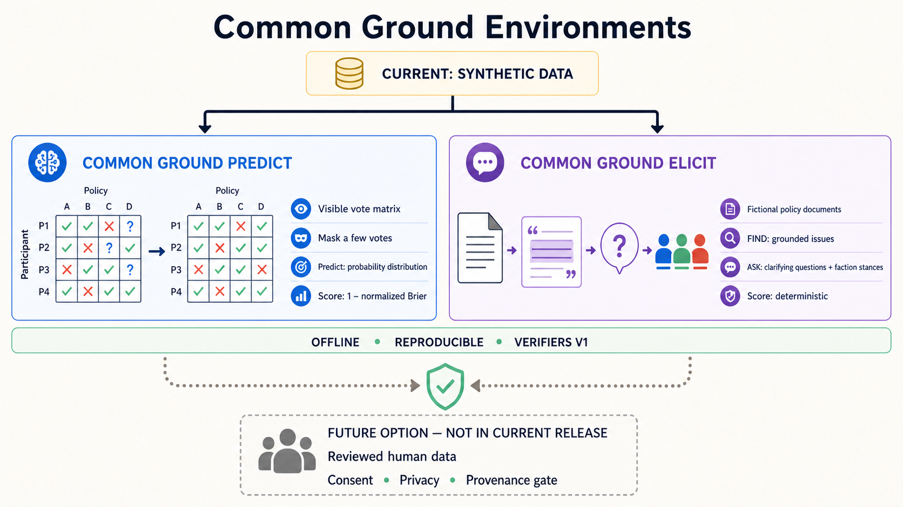

# commonground-envs

Two open, deterministic Verifiers environments for structured reasoning over
synthetic stakeholder data:

- `commonground-predict` requires calibrated probabilities for masked votes in
  a partially visible stakeholder-by-policy matrix.
- `commonground-elicit` requires grounded diagnosis of policy ambiguities,
  contradictions, and gaps, or selection of the two most valuable
  clarification questions from three candidate issues.

This repository contains the unreleased 0.5.0 corrective candidate. The current
public Hub artifacts remain 0.4.1. Predict 0.4.1 is retained as solid but
preliminary; Elicit 0.4.1 is retained only as an immutable historical artifact
because five evaluation rows used an incorrect contradiction relationship and
its public faction prose encoded stances through a finite phrase table.

Version 0.5 authors every contradiction relationship explicitly, derives
stances compositionally from general faction values and question polarity,
makes shaped Find reward precision-sensitive, and replaces hidden Ask
vocabulary matching with structured grounding. It also adds probability-native
Predict comparators and Brier skill. No 0.5 model claim is current until the
new private-artifact study and anonymous installation gates pass. Public answer
keys make every release unsuitable for contamination-resistant leaderboards.

This is the reinforcement-learning environment family associated with
[Context Engine](https://contextengine.sh), an open-source deliberation system
for collecting statements and votes, mapping agreement and disagreement, and
turning the results into auditable organizational decisions. A future governed
export path could allow consenting individuals and groups to retain, license,
or sell preference datasets derived from their sessions. No such exporter is
included here. Every bundled row is synthetic, apart from one explicitly
synthetic, operator-authored demo fixture.



## Packages

| Path | Distribution | Purpose |
| --- | --- | --- |
| `packages/commonground-score` | `commonground-score` 0.4.0 candidate | Vote statistics, calibrated rewards, and Brier skill. |
| `packages/commonground-scenarios` | `commonground-scenarios` 0.4.0 candidate | Offline scenario generation, schema, and validation. |
| `environments/commonground_predict` | `commonground-predict` 0.5.0 candidate | Probabilistic masked-vote prediction. |
| `environments/commonground_elicit` | `commonground-elicit` 0.5.0 candidate | Structured finding diagnosis and top-K clarification. |

Both environments export native Verifiers v1 `Taskset`/`Harness` plugins and a
real legacy `SingleTurnEnv` adapter for the current Prime Hosted Evaluation
runner. The same rows and scoring functions back both interfaces.

## Prime Intellect Hub

- [`charliethompson/commonground-predict@0.4.1`](https://app.primeintellect.ai/dashboard/environments/charliethompson/commonground-predict)
- [`charliethompson/commonground-elicit@0.4.1`](https://app.primeintellect.ai/dashboard/environments/charliethompson/commonground-elicit)

Install the exact reviewed versions with:

```bash
prime env install charliethompson/commonground-predict@0.4.1
prime env install charliethompson/commonground-elicit@0.4.1
```

## What the 0.5 candidate changes

Predict now optimizes `1 - normalized Brier`; argmax accuracy and Brier remain
diagnostics, and the exact masked-cell key set is mandatory. Version 0.5 adds
uniform, empirical-prior, statement-frequency, probabilistic-neighbor, and
text-only comparators plus Brier skill relative to uniform. Standard matrix
comparators remain strong, so the supported construct is semantic-conditioned
matrix completion—not general collective-preference reasoning.

Elicit public faction prose now describes general values once, independently
of current issue types and answer labels. Stances are recomputed from those
values, explicit issue alternatives, and yes-side polarity. Contradiction keys
use authored document/quote relationships rather than lexical inference. Ask
scores structured evidence, issue type, polarity, relationship, and stance
fields without hidden canonical-token overlap. Find keeps strict F1 for
evaluation; its staged training mode uses F1 at every stage so false positives
and hedges reduce reward. Separate diagnostics expose formatting, grounding,
stance, diagnosis, and relationship failures.

See the [0.5.0 evaluation plan](docs/evaluation-plan-0.5.0.md), historical
[0.4.1 evaluation report](docs/evaluation-report-0.4.1.md), historical
[0.3.0 evaluation report](docs/evaluation-report-0.3.0.md),
[0.4-series evaluation plan](docs/evaluation-plan-0.4.0.md), and
[methodology](docs/methodology.md) for exact definitions and limits.

## Setup and verification

```bash
uv sync --all-packages --locked
uv run pytest -q
uv run ruff check .
uv run ruff format --check .
uv run mypy
uv run python scripts/check_dependency_manifests.py --check
uv run python scripts/check_release_wheel.py
```

Each environment artifact bundles an exact, hashed no-dev dependency manifest
generated from `uv.lock`. Workspace sources appear as immutable distribution
pins. The manifest is provenance, not a cross-platform installation lock.
Python is intentionally constrained to `>=3.12,<3.13` for the currently tested
Prime/Verifiers runtime; broader interpreter support has not been attested.

## Comparator and model sweep

The checked-in native-v1 config runs 100 tasks with five rollouts. Run it for
at least four model families, overriding the taskset for both Elicit modes:

```bash
for MODEL in <models>; do
  uv run eval @ configs/eval/baseline-sweep.toml -m "$MODEL" --no-push --rich false
  uv run eval @ configs/eval/baseline-sweep.toml \
    --env.taskset.id commonground-elicit \
    --env.taskset.task-mode find \
    -m "$MODEL" --no-push --rich false
  uv run eval @ configs/eval/baseline-sweep.toml \
    --env.taskset.id commonground-elicit \
    --env.taskset.task-mode elicit-ask \
    -m "$MODEL" --no-push --rich false
done
```

Render only complete saved runs with:

```bash
uv run python scripts/aggregate_baselines.py
uv run python scripts/aggregate_baselines.py --csv /path/to/baselines.csv
```

The historical 0.4.1 exact-artifact study completed all 6,000 planned rollouts across
Claude Sonnet 4.5, Gemini 2.5 Flash, GPT-4.1, and Qwen3 30B A3B Instruct with
no recovered rollouts. Predict rewards ranged from 0.706 to 0.809, strict Find
F1 from 0.050 to 0.160, and Ask utility from 0.016 to 0.105. Predict separates
all four models without saturating. The Elicit results are not transferable to
0.5: they were scored against the superseded corpus and phrase renderer. Exact
historical intervals, artifact hashes, and the correction notice are in the
[0.4.1 evaluation report](docs/evaluation-report-0.4.1.md). Fresh 0.5 Elicit
Find and Ask runs are release-blocking.

Reproduce the task-level Predict and template-hierarchical Elicit analysis with:

```bash
uv run python scripts/analyze_release_study.py \
  --root /path/to/study \
  --elicit-eval-split environments/commonground_elicit/commonground_elicit/data/eval_synthetic_heldout.jsonl \
  --bootstrap-samples 50000 \
  --seed 20260829 \
  --expected-model-count 4 \
  --expected-task-count 100 \
  --expected-rollouts-per-task 5 \
  --require-no-recoveries
```

Repeated rollouts estimate sampling variation, not independent task coverage.
Elicit intervals resample base templates and then variants; Predict intervals
resample tasks. Versions 0.3 and 0.4 Elicit scores are historical and must not
be used as 0.5 evidence because the corpus, visible rationale construct, and
scoring contract changed.

## Provenance, scope, and license

All bundled evaluation answers are published for reproducibility and open
training. Consequential comparison requires a fresh private or server-side
generator family. Non-synthetic custom snapshots are accepted only through the
separate fail-closed contract in
[human-data governance](docs/human-data-governance.md); automated validation
cannot establish consent or legal authority.

Repository code is [Apache-2.0](LICENSE). Predict's adapted synthetic Context
Engine demo fixture remains MPL-2.0; its packaged `NOTICE` records the immutable
source, transformation boundary, hashes, and license treatment. Byte-identical
legal files also live under each environment's `LICENSES/` directory because
current Prime CLI source archives omit top-level legal files. Follow the
[public release checklist](docs/public-release-checklist.md) before publishing.
